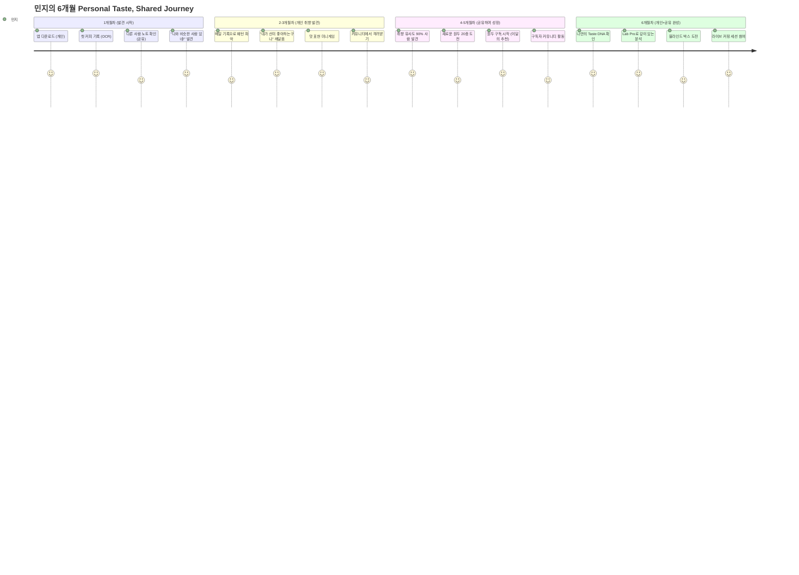
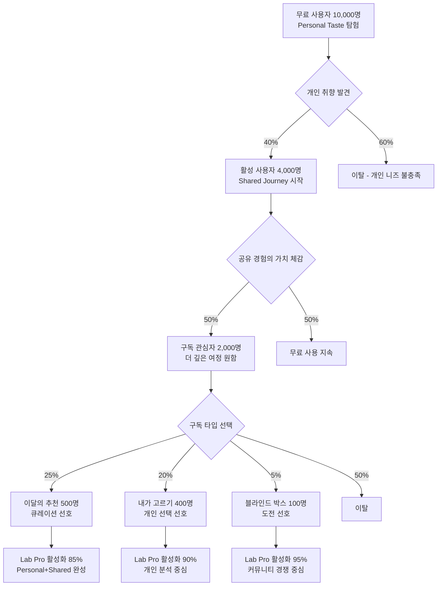

# ☕ Coffee Tasting Journey - 타겟 사용자 분석

## 👥 타겟 사용자 분석
### 핵심 사용자 니즈: "Personal Taste, Shared Journey"

모든 페르소나에게 공통적으로 나타나는 핵심 욕구:
- **개인 취향 발견**: "내가 정말 좋아하는 커피는 뭘까?"
- **표현의 확장**: "이 맛을 어떻게 말로 표현하지?"
- **성장의 확인**: "내가 발전하고 있는 게 맞나?"
- **공유의 즐거움**: "다른 사람들은 어떻게 느꼈을까?"
- **소속감**: "나와 비슷한 취향의 사람들이 있을까?"

### 세분화된 페르소나

#### Café 모드 타겟

##### 1. "일상 기록형" - 민지 (28세, 마케터)
- **특성**: 매일 카페 방문, 인스타그램 활발, 커피로 일상 기록
- **Personal Taste 니즈**: 
  - 내가 좋아하는 커피의 공통점 찾기
  - 나만의 표현 방식 개발하기
  - 시각적으로 매력적인 성장 기록
- **Shared Journey 니즈**:
  - 빠른 기록과 예쁜 공유
  - 다른 사용자들과 커피 취향 비교
  - 취향 유사도 통계 확인
- **Pain Points**:
  - 커피 용어가 어렵고 맛 표현이 서툼
  - 카페에서 뭘 주문해야 할지 모름
  - 매번 같은 커피만 마시는 루틴
- **기대 기능**: OCR 자동 입력, SNS 공유, AI 추천, 센서리 맵(Sensory Map)

##### 2. "탐험 도전형" - 준호 (35세, 개발자)
- **특성**: 새로운 카페와 원두 탐험 즐김, 데이터 기반 의사결정
- **Personal Taste 니즈**:
  - 체계적인 개인 취향 분석
  - 선호도 패턴 발견
  - 도전 과제와 명확한 성장 지표
- **Shared Journey 니즈**:
  - 지역별 카페 맵과 추천
  - 탐험가 커뮤니티 참여
  - 다른 탐험가들과 정보 교환
- **Pain Points**:
  - 방문한 곳과 맛 기억 안남
  - 좋았던 커피 재구매 어려움
  - 탐험의 방향성 부재
- **기대 기능**: 지도 기반 기록, 즐겨찾기, 뱃지 시스템, 추천 알고리즘

#### Lab 모드 타겟

##### 3. "홈바리스타 성장형" - 서연 (30세, 디자이너)
- **특성**: 핸드드립 6개월차, 장비 수집, 유튜브로 독학
- **Personal Taste 니즈**:
  - 내 추출 스킬의 객관적 평가
  - 개인 실력 향상 추적
  - 나만의 레시피 개발
- **Shared Journey 니즈**:
  - 전문가 수준의 분석과 피드백
  - 다른 홈바리스타들과 레시피 공유
  - 멘토링과 커뮤니티 학습
- **Pain Points**:
  - 일정한 맛 재현 어려움
  - 무엇을 개선해야 할지 모름
  - 객관적 평가 기준 부재
- **기대 기능**: 추출 변수 분석, 시뮬레이션, 성장 리포트, 레시피 공유

##### 4. "카페 창업 준비형" - 현우 (38세, 전직 회사원)
- **특성**: 카페 창업 준비 중, SCA 자격증 보유, 시장 조사 중
- **Personal Taste 니즈**:
  - 전문적 커핑 능력 개발
  - 원두 선별 안목 향상
  - 객관적 평가 실력 검증
- **Shared Journey 니즈**:
  - 시장 트렌드와 고객 선호도 파악
  - 전문가 네트워킹
  - 창업 커뮤니티 참여
- **Pain Points**:
  - 객관적 평가 기준 부재
  - 고객 선호도 예측 어려움
  - 메뉴 구성 불확실성
- **기대 기능**: 블라인드 테스팅, 시장 분석, 전문가 네트워킹, B2B 인사이트

#### 원두 구독 타겟 (신규)

##### 5. "다양성 탐험형" - 지훈 (32세, IT 컨설턴트)
- **특성**: 매달 새로운 원두 시도, 소량으로 다양하게 경험하고 싶음
- **Personal Taste 니즈**:
  - 60g씩 여러 종류 맛보며 개인 취향 발견
  - 큐레이션된 원두로 취향 확장
  - Lab Pro로 깊이 있는 개인 분석
- **Shared Journey 니즈**:
  - 같은 원두 구독자들과 테이스팅 비교
  - 전문 큐레이터의 추천과 설명
  - 구독자 커뮤니티 참여
- **Pain Points**:
  - 200g 이상 대용량 구매 부담
  - 원두 선택의 어려움
  - 전문 분석 도구 비용 부담
- **기대 기능**: 이달의 추천, QR 자동 등록, Lab Pro 무료 포함, 구독자 커뮤니티

##### 6. "블라인드 도전형" - 유나 (29세, 바리스타)
- **특성**: 커피 전문가, 실력 검증과 재미 추구
- **Personal Taste 니즈**:
  - 블라인드 테스팅으로 실력 확인
  - 개인 역량의 객관적 평가
  - 새로운 원두 발견과 학습
- **Shared Journey 니즈**:
  - 다른 전문가들과 경쟁과 교류
  - 실시간 커핑 세션 참여
  - 전문가 커뮤니티 네트워킹
- **Pain Points**:
  - 혼자하는 블라인드 테스팅의 한계
  - 정답 확인의 어려움
  - 전문가 커뮤니티 부재
- **기대 기능**: 블라인드 박스, 실시간 라이브 세션, 순위 시스템, 전문가 인증

### User Journey Map - 민지의 6개월 성장 여정 (Personal + Shared 통합)

### Personal vs Shared 니즈 매트릭스

| 페르소나 | Personal Taste 중점 니즈 | Shared Journey 중점 니즈 | 구독 전환 포인트 |
|---------|------------------------|------------------------|-----------------|
| 민지 (일상 기록형) | 나만의 취향 발견, 표현 능력 | 공유와 소통, 취향 비교 | 다양한 원두 경험 욕구 |
| 준호 (탐험 도전형) | 체계적 선호도 분석 | 탐험가 커뮤니티 참여 | 큐레이션된 원두 발견 |
| 서연 (홈바리스타) | 개인 실력 향상 추적 | 전문가 피드백과 멘토링 | Lab Pro 무료 포함 |
| 현우 (창업 준비) | 전문 역량 개발 | 시장 트렌드와 네트워킹 | 시장 분석 데이터 |
| 지훈 (다양성 탐험) | 소량으로 취향 탐험 | 구독자 커뮤니티 교류 | 60g 소량 패키징 |
| 유나 (블라인드 도전) | 실력 검증과 성장 | 전문가 커뮤니티 경쟁 | 블라인드 챌린지 |

### 구독 전환 퍼널 분석 - Personal to Shared 관점

### 페르소나별 핵심 메시지 전달

#### Personal Taste 메시지
- **민지**: "당신만의 특별한 커피 취향을 발견해보세요"
- **준호**: "데이터로 보는 나의 커피 선호도 패턴"
- **서연**: "내 추출 실력의 정확한 진단과 개선점"
- **현우**: "전문가 수준의 객관적 테이스팅 능력 개발"
- **지훈**: "60g씩 탐험하며 찾는 나만의 커피"
- **유나**: "블라인드 테스트로 검증하는 나의 실력"

#### Shared Journey 메시지
- **민지**: "같은 커피를 마신 사람들과 느낌 공유하기"
- **준호**: "전국 탐험가들의 발견과 추천 따라가기"
- **서연**: "홈바리스타들과 레시피 공유하며 함께 성장"
- **현우**: "업계 전문가들과 네트워킹하며 트렌드 파악"
- **지훈**: "같은 원두 구독자들과 테이스팅 비교"
- **유나**: "전문가 커뮤니티에서 실력 경쟁과 교류"

### 사용자 성장 단계별 지원

#### Stage 1: Personal Discovery (개인 발견)
- **목표**: 개인 취향과 표현 능력 개발
- **지원**: AI 가이드, 개인 맞춤 피드백, 성장 추적
- **기간**: 1-2개월

#### Stage 2: Shared Learning (공유 학습)
- **목표**: 커뮤니티와 교류하며 시야 확장
- **지원**: 취향 유사도 매칭, 커뮤니티 참여, 전문가 피드백
- **기간**: 2-4개월

#### Stage 3: Deep Exploration (깊은 탐험)
- **목표**: 구독을 통한 지속적 성장과 전문성 개발
- **지원**: 원두 구독, Lab Pro, 전문가 멘토링
- **기간**: 4개월 이상

### 핵심 성공 지표 (KPI)

#### Personal Taste 지표
- 개인 취향 발견율: 첫 달 내 선호 패턴 3개 이상 식별
- 표현 능력 향상: 3개월 내 사용 어휘 50% 증가
- 개인 만족도: "내 취향을 알게 되었다" 90% 이상

#### Shared Journey 지표
- 커뮤니티 참여율: 월 1회 이상 다른 사용자와 교류
- 취향 매칭 성공률: 유사도 70% 이상 사용자 발견
- 공유 만족도: "함께 배우는 즐거움" 85% 이상