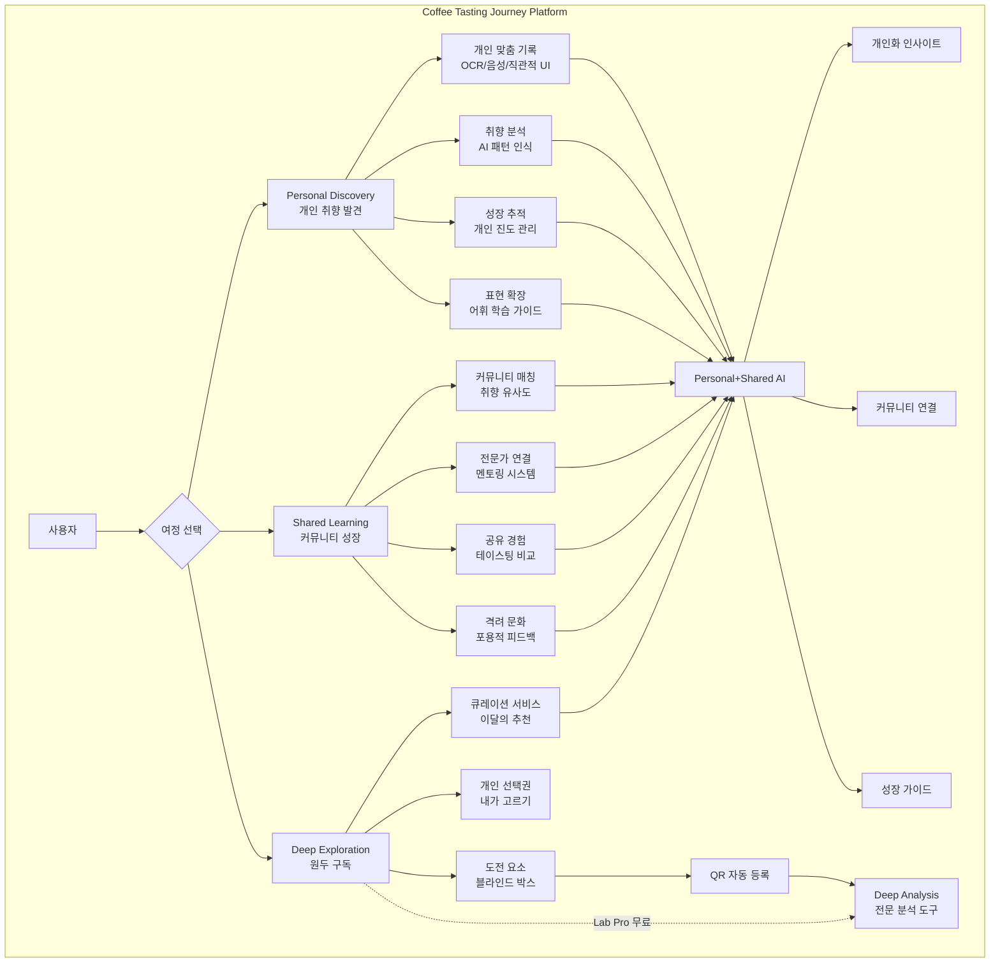
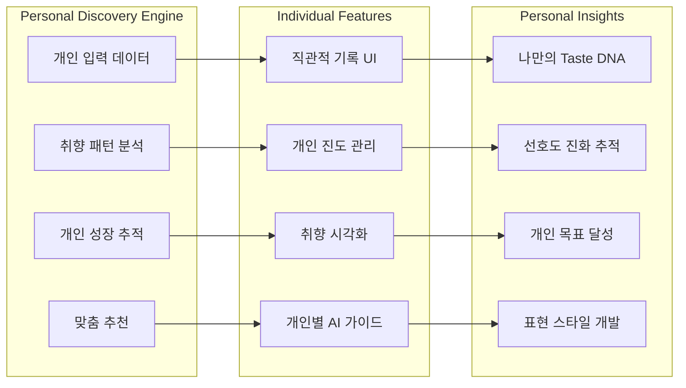
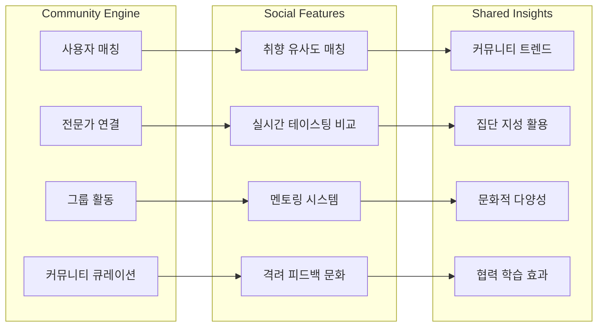
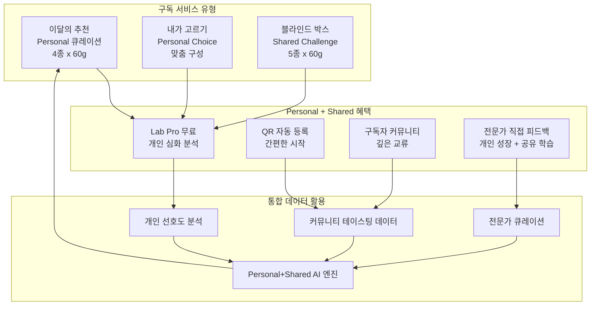
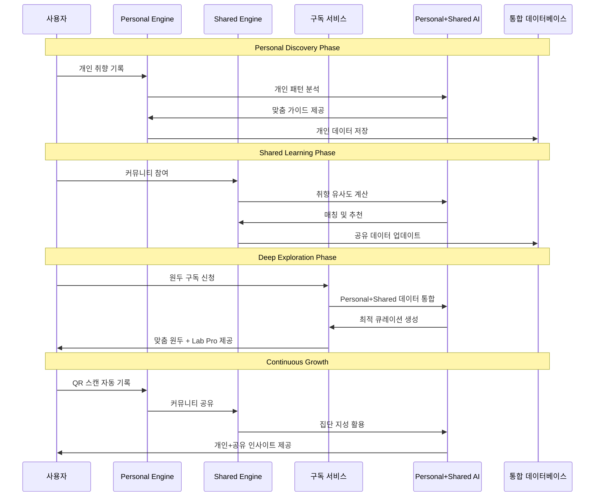

# ☕ Coffee Tasting Journey - 제품 아키텍처

## 🏗️ 제품 아키텍처
### 핵심 설계 철학: "Personal Taste, Shared Journey"

### 통합 플랫폼 시스템

### 핵심 기능 매트릭스 - Personal & Shared 통합

| 기능 영역 | Personal Taste (개인 중심) | Shared Journey (공유 중심) | 구독자 특화 |
|----------|--------------------------|---------------------------|------------|
| **기록 & 발견** | 직관적 입력 + 개인 취향 분석 | 실시간 커뮤니티 비교 + 피드백 | QR 자동 등록 |
| **학습 & 성장** | AI 개인 맞춤 가이드 + 진도 추적 | 전문가 멘토링 + 동료 학습 | Lab Pro 심화 분석 |
| **매칭 & 연결** | 개인 프로필 기반 추천 | 취향 유사도 + 커뮤니티 매칭 | 구독자 전용 네트워크 |
| **표현 & 언어** | 개인 어휘 확장 + 스타일 개발 | 다양한 표현 학습 + 소통 | 로스터 직접 피드백 |
| **도전 & 성취** | 개인 목표 설정 + 달성 추적 | 커뮤니티 챌린지 + 협력 | 블라인드 박스 경쟁 |
| **분석 & 인사이트** | 개인 성장 리포트 | 커뮤니티 트렌드 분석 | 월간 큐레이션 인사이트 |

### Personal Taste 아키텍처 (개인 중심)

### Shared Journey 아키텍처 (공유 중심)

### 원두 구독 시스템 아키텍처 - Deep Exploration

### 통합 데이터 플로우 - Personal to Shared

### 기능 간 시너지 매트릭스

| 연계 기능 | Personal 시너지 | Shared 시너지 | 통합 사용자 가치 |
|----------|----------------|---------------|----------------|
| 개인 기록 + 커뮤니티 비교 | 개인 취향 명확화 | 다양한 관점 학습 | 개성 존중 + 시야 확장 |
| AI 분석 + 전문가 피드백 | 정확한 개인 진단 | 전문성 기반 성장 | 과학적 + 인간적 접근 |
| 구독 + Lab Pro | 개인 맞춤 심화 학습 | 구독자 커뮤니티 형성 | 비용 절감 + 깊이 있는 경험 |
| 블라인드 박스 + 커뮤니티 | 개인 실력 검증 | 집단 도전과 협력 | 성장 동기 + 소속감 |

### 사용자 경험 설계 원칙

#### Personal Taste 중심 설계
1. **개인화 우선**: 모든 기능이 사용자 개인의 취향과 성장에 최적화
2. **직관적 인터페이스**: 복잡한 커피 지식 없이도 쉽게 사용 가능
3. **점진적 학습**: 단계별로 자연스럽게 실력 향상
4. **개인 스타일 존중**: 각자만의 표현 방식 인정과 장려

#### Shared Journey 중심 설계
1. **포용적 커뮤니티**: 다양성을 인정하고 격려하는 문화
2. **자연스러운 연결**: 강제가 아닌 자연스러운 관계 형성
3. **집단 지성 활용**: 커뮤니티의 경험과 지혜 공유
4. **성장 동기 부여**: 함께 배우고 성장하는 즐거움

### 기술 스택 - Personal + Shared 지원

| 영역 | 기술 스택 | Personal 용도 | Shared 용도 |
|------|-----------|---------------|-------------|
| Frontend | React Native | 개인 맞춤 UI | 실시간 커뮤니티 기능 |
| Backend | Node.js, Go | 개인 데이터 처리 | 매칭 및 소셜 기능 |
| AI/ML | Python, PyTorch | 개인 취향 분석 | 커뮤니티 추천 시스템 |
| Database | PostgreSQL | 개인 이력 저장 | 커뮤니티 데이터 관리 |
| Real-time | WebSocket | 개인 알림 | 실시간 채팅/커핑 |
| 구독 관리 | Stripe + Custom | 개인 결제 처리 | 그룹 혜택 관리 |

### 확장성 및 미래 발전 방향

#### Personal Taste 확장
- **IoT 연동**: 개인 추출 장비와 자동 연동
- **생체 데이터**: 개인별 미각 민감도 측정
- **AI 개인 비서**: 24/7 맞춤 커피 가이드

#### Shared Journey 확장
- **글로벌 커뮤니티**: 국경을 넘나드는 커피 문화 교류
- **오프라인 연계**: 지역별 커피 모임 및 이벤트
- **전문가 네트워크**: 세계적 커피 전문가들과의 직접 소통

#### Deep Exploration 확장
- **농장 직연결**: 원산지에서 직접 소싱하는 구독
- **로스팅 체험**: 개인 맞춤 로스팅 서비스
- **커피 여행**: 구독자 전용 커피 농장 투어