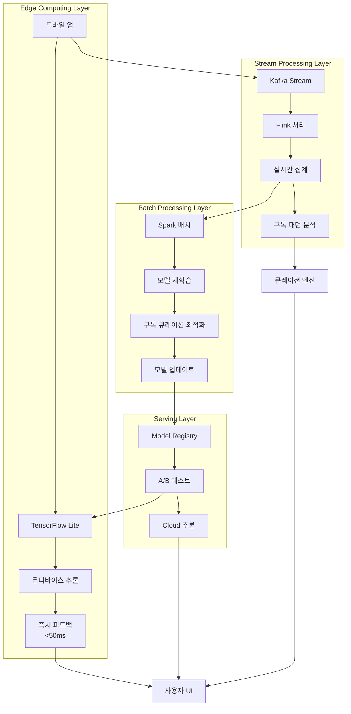

# 🤖 ML 파이프라인 아키텍처

## 맛 벡터화 모델 (Taste2Vec)

커피 테이스팅 경험을 고차원 벡터 공간에 임베딩하는 핵심 모델입니다.

```python
class Taste2Vec:
    """
    맛 경험을 고차원 벡터 공간에 임베딩
    Input: 사용자의 맛 기록 (텍스트 + 수치 + 컨텍스트)
    Output: 128차원 임베딩 벡터
    """
    def __init__(self):
        # 커피 특화 BERT 모델 (사전 학습된 언어 모델)
        self.text_encoder = AutoModel.from_pretrained('coffee-bert-base')
        
        # 커피 감성 어휘 임베딩 모델
        self.sensory_embedding = CoffeeSensoryEmbedding()
        
        # 수치 데이터 인코더 (추출 변수, 강도 등)
        self.numerical_encoder = nn.Sequential(
            nn.Linear(20, 64),
            nn.ReLU(),
            nn.Dropout(0.2),
            nn.Linear(64, 64),
            nn.BatchNorm1d(64)
        )
        
        # 컨텍스트 인코더 (시간, 날씨, 장소 등)
        self.context_encoder = nn.LSTM(
            input_size=10,
            hidden_size=32,
            num_layers=2,
            batch_first=True
        )
        
        # 최종 융합 레이어
        self.fusion_layer = nn.Linear(224, 128)  # 감성 임베딩 추가로 차원 증가
    
    def encode(self, taste_record):
        # 1. 텍스트 임베딩 (맛 노트, 자유 메모)
        text_features = self.encode_text(taste_record['notes'])
        
        # 2. 감성 어휘 임베딩
        sensory_features = self.sensory_embedding.encode(taste_record['notes'])
        
        # 3. 수치 임베딩 (강도, 추출 변수)
        numerical_features = self.encode_numerical(taste_record['metrics'])
        
        # 4. 컨텍스트 임베딩 (시간대, 날씨, 기분)
        context_features = self.encode_context(taste_record['context'])
        
        # 5. 멀티모달 융합
        combined = torch.cat([
            text_features,      # 64d
            sensory_features,   # 64d
            numerical_features, # 64d
            context_features    # 32d
        ], dim=1)
        
        # 6. 최종 임베딩 및 정규화
        embedding = self.fusion_layer(combined)
        return F.normalize(embedding, p=2, dim=1)
```

## 실시간 분석 아키텍처



## 멀티모달 데이터 처리

### 1. 텍스트 데이터 처리
```python
class TextEncoder:
    """커피 특화 텍스트 인코더"""
    def __init__(self):
        self.tokenizer = AutoTokenizer.from_pretrained('coffee-bert-base')
        self.model = AutoModel.from_pretrained('coffee-bert-base')
        
    def encode_text(self, text):
        """텍스트를 64차원 벡터로 인코딩"""
        inputs = self.tokenizer(
            text, 
            return_tensors='pt',
            padding=True,
            truncation=True,
            max_length=512
        )
        
        with torch.no_grad():
            outputs = self.model(**inputs)
            # CLS 토큰의 임베딩 사용
            text_embedding = outputs.last_hidden_state[:, 0, :]
            
        return text_embedding
```

### 2. 수치 데이터 처리
```python
class NumericalEncoder:
    """추출 변수와 강도 등 수치 데이터 인코더"""
    def __init__(self):
        self.scaler = StandardScaler()
        self.encoder = nn.Sequential(
            nn.Linear(20, 64),
            nn.ReLU(),
            nn.Dropout(0.2),
            nn.Linear(64, 64),
            nn.BatchNorm1d(64)
        )
    
    def encode_numerical(self, metrics):
        """수치 데이터를 64차원 벡터로 인코딩"""
        # 입력 변수들
        features = [
            metrics.get('temperature', 0),      # 추출 온도
            metrics.get('grind_size', 0),       # 분쇄도
            metrics.get('brew_ratio', 0),       # 추출 비율
            metrics.get('brew_time', 0),        # 추출 시간
            metrics.get('acidity', 0),          # 산미 강도
            metrics.get('sweetness', 0),        # 단맛 강도
            metrics.get('bitterness', 0),       # 쓴맛 강도
            metrics.get('body', 0),             # 바디감
            metrics.get('aftertaste', 0),       # 후미
            metrics.get('balance', 0),          # 균형감
            # ... 추가 변수들
        ]
        
        # 정규화 및 인코딩
        features_tensor = torch.tensor(features, dtype=torch.float32)
        features_normalized = self.scaler.transform(features_tensor.unsqueeze(0))
        
        return self.encoder(features_normalized)
```

### 3. 컨텍스트 데이터 처리
```python
class ContextEncoder:
    """시간, 날씨, 기분 등 컨텍스트 데이터 인코더"""
    def __init__(self):
        self.lstm = nn.LSTM(
            input_size=10,
            hidden_size=32,
            num_layers=2,
            batch_first=True
        )
        
    def encode_context(self, context):
        """컨텍스트를 32차원 벡터로 인코딩"""
        # 시계열 컨텍스트 특성
        context_sequence = [
            context.get('hour_of_day', 0) / 24,         # 시간대 (0-1)
            context.get('day_of_week', 0) / 7,          # 요일 (0-1)
            context.get('weather_temp', 20) / 40,       # 기온 (정규화)
            context.get('humidity', 50) / 100,          # 습도 (0-1)
            context.get('mood_score', 5) / 10,          # 기분 점수 (0-1)
            context.get('stress_level', 5) / 10,        # 스트레스 (0-1)
            context.get('energy_level', 5) / 10,        # 에너지 (0-1)
            context.get('hunger_level', 5) / 10,        # 배고픔 (0-1)
            context.get('social_setting', 0),           # 사회적 상황 (원핫)
            context.get('location_type', 0)             # 장소 유형 (원핫)
        ]
        
        # LSTM으로 시퀀스 인코딩
        context_tensor = torch.tensor(context_sequence, dtype=torch.float32)
        context_tensor = context_tensor.unsqueeze(0).unsqueeze(0)  # (1, 1, 10)
        
        lstm_out, (hidden, cell) = self.lstm(context_tensor)
        return hidden[-1]  # 마지막 레이어의 hidden state 사용
```

## 온라인 학습 시스템

```python
class OnlineLearningSystem:
    """실시간 사용자 피드백을 통한 온라인 학습"""
    def __init__(self):
        self.taste2vec = Taste2Vec()
        self.optimizer = AdamW(self.taste2vec.parameters(), lr=1e-4)
        self.replay_buffer = ReplayBuffer(max_size=10000)
        
    def update_from_feedback(self, user_id, taste_record, feedback):
        """사용자 피드백으로 모델 업데이트"""
        # 1. 현재 임베딩 생성
        current_embedding = self.taste2vec.encode(taste_record)
        
        # 2. 피드백 기반 타겟 임베딩 계산
        target_embedding = self._calculate_target_from_feedback(
            current_embedding, feedback
        )
        
        # 3. 손실 계산 및 백프로파게이션
        loss = F.mse_loss(current_embedding, target_embedding)
        
        self.optimizer.zero_grad()
        loss.backward()
        self.optimizer.step()
        
        # 4. 리플레이 버퍼에 저장
        self.replay_buffer.add(taste_record, feedback, target_embedding)
        
        # 5. 주기적으로 리플레이 버퍼에서 배치 학습
        if len(self.replay_buffer) > 100:
            self._replay_learning()
    
    def _calculate_target_from_feedback(self, current_embedding, feedback):
        """피드백을 바탕으로 타겟 임베딩 계산"""
        if feedback['liked']:
            # 긍정 피드백: 현재 임베딩 강화
            return current_embedding * 1.1
        else:
            # 부정 피드백: 반대 방향으로 조정
            return current_embedding * 0.9
```

## 모델 배포 및 A/B 테스트

```python
class ModelServingSystem:
    """모델 배포 및 A/B 테스트 시스템"""
    def __init__(self):
        self.model_registry = ModelRegistry()
        self.ab_tester = ABTester()
        self.performance_monitor = PerformanceMonitor()
        
    def deploy_model(self, model_version, traffic_percentage=10):
        """새 모델 버전 점진적 배포"""
        # 1. 모델 등록
        self.model_registry.register(model_version)
        
        # 2. A/B 테스트 설정
        self.ab_tester.create_experiment(
            name=f"taste2vec_v{model_version}",
            control_model="current_production",
            treatment_model=f"v{model_version}",
            traffic_split={
                "control": 100 - traffic_percentage,
                "treatment": traffic_percentage
            },
            metrics=[
                "recommendation_ctr",
                "user_satisfaction",
                "subscription_retention"
            ]
        )
        
        # 3. 성능 모니터링 시작
        self.performance_monitor.start_monitoring(model_version)
        
    def evaluate_experiment(self, experiment_name):
        """A/B 테스트 결과 평가"""
        results = self.ab_tester.get_results(experiment_name)
        
        # 통계적 유의성 검정
        significance = self._statistical_test(results)
        
        if significance['is_significant'] and significance['improvement'] > 0.05:
            return "promote_to_production"
        elif significance['is_significant'] and significance['improvement'] < -0.05:
            return "rollback"
        else:
            return "continue_experiment"
```

## 주요 특징

### 1. **멀티모달 학습**
- 텍스트 (맛 표현, 감성 어휘, 비유)
- 수치 (강도, 추출 변수)
- 컨텍스트 (시간, 날씨, 기분)
- 구독 데이터 (구독 이력, 피드백, Lab 사용 패턴)
- 이 모든 것을 통합하여 128차원 벡터로 표현

### 2. **실시간 처리 능력**
- 온디바이스 추론으로 50ms 이내 응답
- 스트림 처리로 실시간 패턴 분석
- 배치 처리로 주기적 모델 업데이트

### 3. **온라인 학습**
- 사용자 피드백을 즉시 모델에 반영
- 리플레이 버퍼를 통한 안정적 학습
- 점진적 개인화 강화

### 4. **안전한 모델 배포**
- A/B 테스트를 통한 점진적 배포
- 실시간 성능 모니터링
- 자동 롤백 시스템

### 5. **확장 가능한 아키텍처**
- 마이크로서비스 기반 설계
- 수평적 확장 지원
- 모듈별 독립적 업데이트 가능