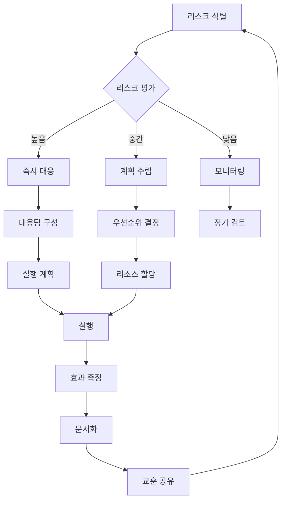

# 🛡️ 리스크 관리

## 종합 리스크 매트릭스

| 카테고리 | 리스크 | 영향도 | 확률 | 위험도 | 대응 전략 |
|---------|--------|--------|------|--------|-----------|
| **기술** | AI 모델 정확도 부족 | 높음 | 중간 | 🟡 | 지속적 학습, A/B 테스트, 사용자 피드백 루프 |
| **기술** | 확장성 이슈 | 높음 | 낮음 | 🟢 | 마이크로서비스, 자동 스케일링, 부하 테스트 |
| **기술** | 데이터 유실 | 매우 높음 | 낮음 | 🟡 | 실시간 백업, 다중 리전, DR 계획 |
| **보안** | 개인정보 유출 | 매우 높음 | 낮음 | 🟡 | E2E 암호화, 정기 감사, 버그 바운티 |
| **비즈니스** | 경쟁사 추격 | 중간 | 높음 | 🟡 | 빠른 혁신, 특허 출원, 커뮤니티 락인 |
| **비즈니스** | 시장 수요 부족 | 높음 | 중간 | 🟡 | MVP 검증, 피벗 준비, 린 접근 |
| **운영** | 핵심 인재 이탈 | 높음 | 중간 | 🟡 | 스톡옵션, 문화 구축, 지식 공유 |
| **재무** | 자금 소진 | 매우 높음 | 중간 | 🔴 | 런웨이 관리, 수익 다각화, 비용 최적화 |
| **규제** | 데이터 규제 변화 | 중간 | 낮음 | 🟢 | 법무 자문, 컴플라이언스 체계 |
| **기술** | OCR 인식률 저하 | 중간 | 중간 | 🟡 | 멀티 엔진, 수동 보정, 지속 개선 |
| **운영** | 원두 재고 관리 실패 | 높음 | 중간 | 🟡 | 실시간 재고 추적, AI 수요 예측, 안전 재고 |
| **운영** | 구독 배송 지연 | 중간 | 낮음 | 🟢 | 복수 물류 파트너, SLA 계약, 실시간 추적 |
| **비즈니스** | 로스터리 품질 저하 | 높음 | 낮음 | 🟡 | 정기 블라인드 테스트, 즉시 교체 시스템 |

## 리스크 대응 프로세스



## 비상 대응 계획 (BCP)

```yaml
business_continuity_plan:
  scenarios:
    major_outage:
      definition: "핵심 서비스 중단 > 1시간"
      response:
        - immediate: "상태 페이지 업데이트"
        - t_plus_5min: "대응팀 소집"
        - t_plus_15min: "근본 원인 분석 시작"
        - t_plus_30min: "복구 계획 실행"
        - t_plus_1h: "경영진 보고"
      communication:
        - users: "인앱 알림, 이메일, 소셜 미디어"
        - team: "Slack 전용 채널"
        - stakeholders: "직접 연락"
    
    data_breach:
      definition: "개인정보 유출 가능성 감지"
      response:
        - immediate: "영향 범위 파악"
        - t_plus_30min: "접근 차단"
        - t_plus_1h: "포렌식 시작"
        - t_plus_4h: "법적 검토"
        - t_plus_24h: "사용자 통지"
      compliance:
        - gdpr: "72시간 내 당국 신고"
        - users: "지체 없이 통지"
    
    key_person_loss:
      definition: "핵심 인력 갑작스런 이탈"
      response:
        - immediate: "권한 이전"
        - t_plus_1day: "업무 재분배"
        - t_plus_1week: "채용 프로세스 시작"
      preparation:
        - documentation: "모든 핵심 업무 문서화"
        - cross_training: "최소 2명 백업"
        - knowledge_base: "중앙 집중식 위키"
        
    subscription_failure:
      definition: "구독 배송 실패 > 5% 또는 재고 부족"
      response:
        - immediate: "영향받는 고객 파악"
        - t_plus_30min: "대체 원두 확보"
        - t_plus_1h: "고객 개별 연락"
        - t_plus_4h: "보상 정책 실행"
      compensation:
        - option_1: "다음달 50% 할인"
        - option_2: "프리미엄 원두 무료 추가"
        - option_3: "전액 환불 + 사과 선물"
      
    coffee_quality_issue:
      definition: "로스터리 품질 기준 미달"
      response:
        - immediate: "해당 배치 배송 중단"
        - t_plus_1h: "전수 품질 검사"
        - t_plus_4h: "대체 로스터리 확보"
        - t_plus_24h: "영향받은 고객 보상"
      prevention:
        - "주간 블라인드 품질 테스트"
        - "로스터리 정기 방문 감사"
        - "고객 피드백 실시간 모니터링"
```

## 원두 구독 서비스 특화 리스크 관리

```yaml
subscription_risk_management:
  inventory_risks:
    재고_부족:
      모니터링: "일일 재고 수준 체크"
      임계값: "3일분 미만"
      대응:
        - "긴급 로스팅 요청"
        - "대체 원두 확보"
        - "고객 사전 안내"
    
    품질_변질:
      예방: "FIFO 시스템, 온습도 관리"
      검사: "입고시 + 주간 샘플링"
      대응: "즉시 폐기 및 교체"
  
  logistics_risks:
    배송_지연:
      파트너: "CJ대한통운 + 한진택배 (백업)"
      추적: "실시간 API 연동"
      보상: "지연 일수별 차등 보상"
    
    포장_손상:
      예방: "이중 포장, 충격 완화재"
      보험: "배송 보험 가입"
      대응: "즉시 재발송"
  
  partnership_risks:
    로스터리_이탈:
      계약: "최소 6개월 독점 계약"
      관계: "월간 미팅, 분기 워크샵"
      백업: "카테고리별 3개 이상 파트너"
    
    품질_일관성:
      모니터링: "배치별 커핑 스코어"
      피드백: "실시간 고객 평가 공유"
      인센티브: "품질 보너스 제도"
```