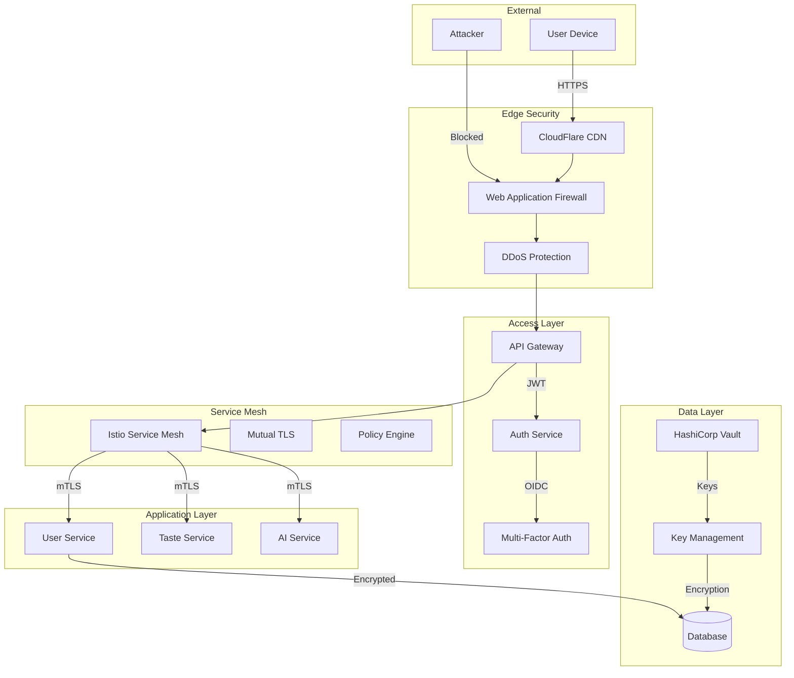

## 🔒 데이터 거버넌스 & 보안

### 데이터 분류 및 처리 체계

```yaml
data_governance:
  classification:
    public:
      examples: ["username", "level", "public_badges"]
      encryption: "not_required"
      retention: "indefinite"
      access: "unrestricted"
    
    internal:
      examples: ["usage_analytics", "aggregated_stats"]
      encryption: "at_rest"
      retention: "3_years"
      access: "employees_only"
    
    confidential:
      examples: ["email", "taste_records", "preferences"]
      encryption: "at_rest_and_in_transit"
      retention: "user_active_plus_2_years"
      access: "need_to_know"
      anonymization: "after_retention"
    
    restricted:
      examples: ["taste_dna", "payment_info", "location_history"]
      encryption: "field_level_AES256"
      retention: "user_active_plus_6_months"
      access: "strict_approval_required"
      audit: "every_access_logged"
    
  principles:
    data_minimization:
      - "수집 목적 명확화"
      - "필요 최소한만 수집"
      - "자동 삭제 정책"
    
    purpose_limitation:
      - "명시된 목적으로만 사용"
      - "목적 변경 시 재동의"
    
    accuracy:
      - "정기적 데이터 검증"
      - "사용자 수정 권한"
    
    security:
      - "계층별 보안 적용"
      - "정기 보안 감사"
      - "침해 대응 계획"
```

### Zero Trust 보안 아키텍처



### GDPR/CCPA 준수 체계

#### 사용자 권리 보장 시스템
```python
class PrivacyRightsManager:
    def __init__(self):
        self.request_handlers = {
            'access': self.handle_access_request,
            'rectification': self.handle_rectification_request,
            'erasure': self.handle_erasure_request,
            'portability': self.handle_portability_request,
            'restriction': self.handle_restriction_request,
            'objection': self.handle_objection_request
        }
    
    async def handle_access_request(self, user_id):
        """데이터 접근권 - 30일 내 응답"""
        data = await self.collect_all_user_data(user_id)
        
        return {
            'personal_data': data.personal,
            'taste_records': data.taste_records,
            'ai_insights': data.ai_insights,
            'usage_logs': data.usage_logs,
            'third_party_sharing': data.third_party,
            'download_links': {
                'json': self.generate_download_link(data, 'json'),
                'csv': self.generate_download_link(data, 'csv'),
                'pdf': self.generate_download_link(data, 'pdf')
            }
        }
    
    async def handle_erasure_request(self, user_id):
        """삭제권 - Right to be Forgotten"""
        # 법적 보존 의무 확인
        legal_hold = await self.check_legal_obligations(user_id)
        
        if not legal_hold:
            # 완전 삭제 프로세스
            await self.delete_user_data(user_id)
            await self.propagate_deletion_to_partners(user_id)
            await self.verify_deletion(user_id)
            
            return {
                'status': 'completed',
                'deleted_from': ['database', 'cache', 'backups', 'partners'],
                'completion_date': datetime.now(),
                'verification_code': self.generate_verification_code()
            }
        else:
            return {
                'status': 'partial',
                'reason': legal_hold.reason,
                'retained_data': legal_hold.data_types,
                'retention_until': legal_hold.until_date
            }
```

### 보안 모니터링 및 대응

```yaml
security_monitoring:
  siem:
    tool: "Splunk Enterprise Security"
    data_sources:
      - application_logs
      - infrastructure_logs
      - network_traffic
      - user_behavior
    
  threat_detection:
    rules:
      - name: "Abnormal Data Access"
        condition: "access_rate > 100/min OR data_volume > 1GB"
        severity: "high"
        action: ["alert", "rate_limit", "investigate"]
        
      - name: "Suspicious Login Pattern"
        condition: "failed_attempts > 5 OR geo_anomaly"
        severity: "medium"
        action: ["alert", "mfa_required", "notify_user"]
        
      - name: "Data Exfiltration Attempt"
        condition: "bulk_export AND unusual_time"
        severity: "critical"
        action: ["block", "alert", "incident_response"]
    
  incident_response:
    team:
      - security_lead: "24/7 on-call"
      - dev_ops: "escalation"
      - legal: "data breach assessment"
      - pr: "communication"
    
    playbooks:
      - data_breach_response
      - ddos_mitigation
      - account_takeover
      - insider_threat
    
    forensics:
      tools: ["CloudTrail", "VPC Flow Logs", "Application Logs"]
      retention: "1 year"
      chain_of_custody: "maintained"
```

### 정기 보안 감사

```yaml
security_audits:
  internal:
    frequency: "monthly"
    scope:
      - access_reviews: "권한 적정성"
      - configuration_audit: "보안 설정"
      - patch_management: "취약점 패치"
      - log_review: "이상 징후"
  
  external:
    penetration_testing:
      frequency: "quarterly"
      scope: ["web_app", "mobile_app", "api", "infrastructure"]
      providers: ["Approved vendor list"]
    
    compliance_audit:
      frequency: "annually"
      standards: ["ISO 27001", "SOC 2", "PCI DSS"]
      
    bug_bounty:
      platform: "HackerOne"
      scope: ["*.coffeetasting.app", "API endpoints"]
      rewards:
        critical: "$5,000 - $10,000"
        high: "$1,000 - $5,000"
        medium: "$500 - $1,000"
        low: "$100 - $500"
```