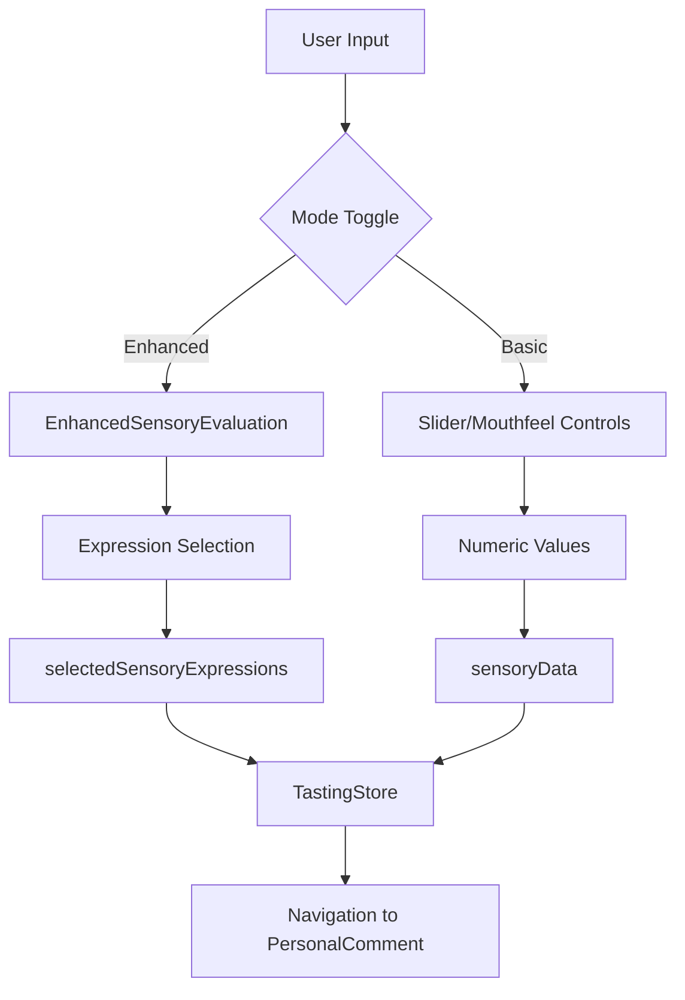

# SensoryScreen Component Design Specification

## Overview
The SensoryScreen is a critical component in the coffee tasting flow that captures sensory evaluation data using both traditional slider-based and Korean expression-based methodologies.

## Architecture

### Component Hierarchy
```
SensoryScreen (Container)
├── NavigationBar
├── ProgressBar
├── HeaderSection
│   ├── Title & Subtitle
│   ├── GuideMessage
│   └── ModeToggle (Basic/Enhanced)
├── ContentSection
│   ├── [Enhanced Mode]
│   │   └── EnhancedSensoryEvaluation
│   │       ├── CategoryList
│   │       ├── ExpressionSelector
│   │       └── SummaryView
│   └── [Basic Mode]
│       ├── SliderSection (x6)
│       └── MouthfeelSection
├── CompleteButton
└── SensoryOnboarding (Modal)
```

### State Management Design

#### Local State
```typescript
interface SensoryScreenState {
  // UI State
  showEnhanced: boolean;
  showOnboarding: boolean;
  
  // Sensory Data (via useSensoryState hook)
  sensoryData: {
    body: number;
    acidity: number;
    sweetness: number;
    finish: number;
    bitterness: number;
    balance: number;
    mouthfeel: MouthfeelType;
  };
}
```

#### Global State (Zustand)
```typescript
interface TastingStore {
  // Current tasting data
  currentTasting: ITastingRecord;
  
  // Korean expressions
  selectedSensoryExpressions: SelectedSensoryExpression[];
  
  // Actions
  updateField: (key: string, value: any) => void;
  setSelectedSensoryExpressions: (expressions: SelectedSensoryExpression[]) => void;
}
```

### Data Flow



### Component Interfaces

#### Props Interfaces
```typescript
// No props - uses hooks for all data
interface SensoryScreenProps {}

// Child component props
interface EnhancedSensoryEvaluationProps {
  selectedExpressions: SelectedExpression[];
  onExpressionChange: (expressions: SelectedExpression[]) => void;
  beginnerMode?: boolean;
  showDescriptions?: boolean;
}

interface SliderSectionProps {
  title: string;
  value: number;
  onValueChange: (value: number) => void;
  leftLabel: string;
  rightLabel: string;
}

interface MouthfeelButtonProps {
  option: MouthfeelType;
  isSelected: boolean;
  onPress: () => void;
}
```

### Hook Architecture

#### useSensoryState
- Manages numeric sensory values and mouthfeel
- Provides update functions with proper typing
- Handles default values
- Isolated from global state for reusability

#### Custom Navigation Hook (Proposed)
```typescript
const useSensoryNavigation = () => {
  const navigation = useNavigation();
  
  const navigateToNext = useCallback(() => {
    navigation.navigate('PersonalComment');
  }, [navigation]);
  
  const navigateBack = useCallback(() => {
    navigation.goBack();
  }, [navigation]);
  
  return { navigateToNext, navigateBack };
};
```

### Performance Optimizations

1. **Memoization**
   - `useMemo` for static arrays (mouthfeelOptions)
   - `useCallback` for all event handlers
   - React.memo for child components

2. **Lazy Loading**
   - Onboarding modal loaded on demand
   - Expression data loaded progressively

3. **State Updates**
   - Batched updates for multiple fields
   - Optimistic UI updates

### Accessibility Design

1. **Screen Reader Support**
   - Proper labels for all interactive elements
   - Value announcements for sliders
   - Selection state announcements

2. **Keyboard Navigation**
   - Tab order follows visual hierarchy
   - Enter/Space for selections
   - Arrow keys for sliders

3. **Visual Indicators**
   - High contrast selection states
   - Clear focus indicators
   - Progress indication

### Error Handling

1. **Data Validation**
   - Numeric bounds checking (1-5)
   - Required field validation
   - Expression limit enforcement (max 3 per category)

2. **User Feedback**
   - Visual feedback for invalid selections
   - Clear error messages
   - Recovery suggestions

### Testing Strategy

1. **Unit Tests**
   - Hook behavior
   - Data transformation logic
   - Validation functions

2. **Integration Tests**
   - Mode switching
   - Data persistence
   - Navigation flow

3. **E2E Tests**
   - Complete sensory evaluation flow
   - Onboarding flow
   - Data submission

### Future Enhancements

1. **Smart Recommendations**
   - ML-based expression suggestions
   - Historical preference analysis
   - Personalized defaults

2. **Advanced Visualizations**
   - Radar charts for sensory profiles
   - Comparison with coffee averages
   - Trend analysis over time

3. **Social Features**
   - Share sensory profiles
   - Compare with friends
   - Community averages

### API Integration Points

```typescript
// Future API endpoints
interface SensoryAPI {
  // Save sensory evaluation
  saveSensoryData(tastingId: string, data: SensoryData): Promise<void>;
  
  // Get expression recommendations
  getRecommendations(coffeeType: string): Promise<Expression[]>;
  
  // Analytics
  trackExpressionUsage(expressions: SelectedExpression[]): Promise<void>;
}
```

### Migration Path

1. **Phase 1** (Current)
   - Local state management
   - Basic mode/enhanced mode toggle
   - Static expression data

2. **Phase 2**
   - API integration
   - Persistent user preferences
   - Analytics integration

3. **Phase 3**
   - ML recommendations
   - Advanced visualizations
   - Social features