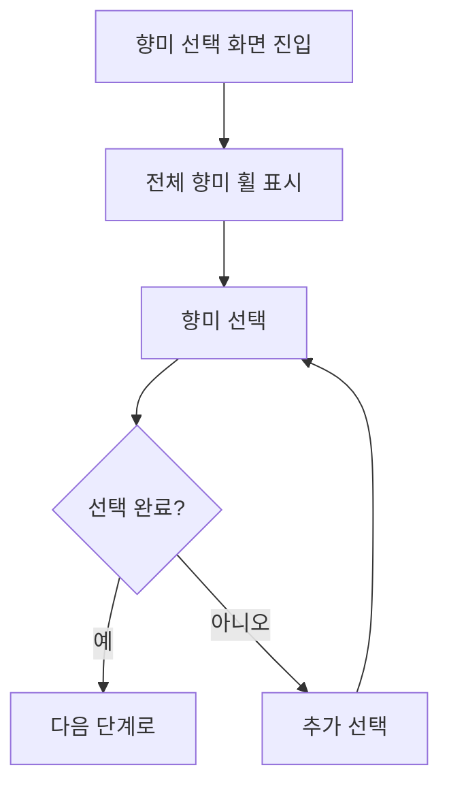

# 향미 선택 화면 기능 및 유저플로우 문서

## 📋 개요

향미 선택 화면은 커피 테이스팅 앱의 핵심 기능으로, 사용자가 커피에서 감지한 향미를 체계적으로 선택하고 기록할 수 있는 인터페이스입니다. Cafe Mode에서 전문가 수준의 모든 기능을 제공하며, 개인화된 향미 라이브러리와 연동됩니다.

## 🏗️ 화면 구성 요소

### 1. 헤더 영역
```
[←] 향미 선택
```
- **뒤로가기 버튼**: 이전 단계로 이동
- **제목**: 향미 선택

### 2. 진행 상황 표시
```
☕ Cafe Mode                            2/6
████████░░░░░░░░░░░░░░░░
커피   향미   감각   노트   로스터   결과
```

### 3. 선택된 향미 표시 (Sticky Header)
```
┌─────────────────────────────────────────┐
│ 선택한 향미 (3/5)                전체 삭제 │
│ [Blackberry ×] [Almond ×] [Vanilla ×]   │
└─────────────────────────────────────────┘
```

### 4. 안내 메시지
```
구체적인 향미를 찾아보세요
최대 5개까지 선택 가능 • 3/5

[모든 카테고리 열기]
```

### 5. 검색 기능
```
🔍 향미 검색...
```

### 6. 향미 카테고리
```
┌─────────────────────────────────────────┐
│ Fruity                          열림 ∧  │
├─────────────────────────────────────────┤
│   Berry                                 │
│   [Blackberry] [Raspberry] [Blueberry] │
│                                         │
│   Citrus                                │
│   [Lemon] [Lime] [Orange] [Grapefruit] │
└─────────────────────────────────────────┘
```

### 7. 하단 네비게이션
```
[← 이전]                    [건너뛰기] [다음 →]
```

## ⚙️ 기능 상세 설명

### 3.1 향미 카테고리 관리

#### 카테고리 토글
- **기능**: 각 주요 카테고리(Fruity, Nutty, Sweet 등)를 열고 닫기
- **동작**: 헤더 탭 시 해당 카테고리의 서브카테고리와 향미 목록 표시/숨김
- **시각적 피드백**: 열림/닫힘 상태를 아이콘과 텍스트로 표시

#### 전체 카테고리 제어
- **모든 카테고리 열기**: 모든 카테고리를 한 번에 확장
- **모든 카테고리 닫기**: 모든 카테고리를 한 번에 축소
- **상태 감지**: 현재 열린 카테고리 수에 따라 버튼 텍스트 변경

### 3.2 향미 선택 시스템

#### 선택 제한
- **최대 5개까지 선택 가능**

#### 선택/해제 동작
- **선택**: 향미 버튼 탭 시 선택 목록에 추가
- **해제**: 선택된 향미 다시 탭 또는 × 버튼으로 제거
- **제한 처리**: 최대 개수 도달 시 비활성화 및 시각적 표시

#### 시각적 상태
```css
/* 미선택 상태 */
bg-white border border-gray-300 text-gray-700

/* 선택 상태 */
bg-blue-500 text-white shadow-md

/* 비활성화 상태 */
opacity-50 cursor-not-allowed
```

### 3.3 검색 기능

#### 실시간 검색
- **대상**: 모든 향미명에 대한 부분 일치 검색
- **필터링**: 검색어와 일치하는 향미만 표시
- **하이라이팅**: 검색어 부분 강조 표시

## 🔄 유저플로우

### 4.1 기본 플로우



### 4.2 세부 인터랙션 플로우

#### 카테고리 탐색
1. **카테고리 헤더 탭** → 서브카테고리 확장/축소
2. **서브카테고리 확인** → 관련 향미들 탐색
3. **향미 선택** → 선택 상태 변경 및 상단에 표시

#### 선택 관리
1. **향미 탭** → 선택/해제 토글
2. **상단 선택 영역** → 선택된 향미 확인
3. **개별 제거** → × 버튼으로 특정 향미 제거
4. **전체 삭제** → 모든 선택 초기화

#### 검색 활용
1. **검색어 입력** → 실시간 필터링
2. **결과 확인** → 일치하는 향미만 표시
3. **검색에서 선택** → 일반 선택과 동일한 동작
4. **검색 초기화** → 전체 목록 복원

### 4.3 오류 상황 처리

#### 최대 선택 수 초과
```
사용자 액션: 이미 최대 개수 선택된 상태에서 새 향미 탭
시스템 반응: 버튼 비활성화 + 토스트 메시지 "최대 5개까지 선택 가능"
해결 방법: 기존 향미 제거 후 새 향미 선택
```

#### 빈 선택 상태
```
사용자 액션: 아무 향미도 선택하지 않고 다음 버튼 탭
시스템 반응: 단계 건너뛰기로 처리 (선택 사항이므로)
```

## 🎯 상호작용 및 피드백

### 5.1 즉시 피드백

#### 선택 상태 변화
- **애니메이션**: 버튼 색상 변화 (0.3초 전환)
- **햅틱 피드백**: 가벼운 진동 피드백
- **상단 업데이트**: 선택된 향미 즉시 표시

#### 카테고리 토글
- **아이콘 회전**: 화살표 방향 변경 애니메이션
- **부드러운 확장**: 서브카테고리 슬라이드 애니메이션
- **상태 표시**: "열림/닫힘" 텍스트 업데이트

### 6.2 진행 상황 안내

#### 선택 진행도
```
선택한 향미 (3/5)
최대 5개까지 선택 가능 • 3/5
```

#### 카테고리별 현황
- 각 카테고리에서 선택된 향미 수 표시
- 전체 진행률 실시간 업데이트

### 6.3 사용자 도움말

#### 인앱 가이드
- 처음 방문 시 간단한 온보딩
- 빈 상태일 때 안내 메시지
- 제한 도달 시 토스트 메시지

## 🔧 기술적 구현 사항

### 6.1 상태 관리

#### 주요 State
```javascript
const [selectedFlavors, setSelectedFlavors] = useState([]);
const [expandedCategories, setExpandedCategories] = useState(() => {
  // Cafe Mode에서는 모든 카테고리를 기본적으로 열어둠
  return Object.keys(flavorCategories);
});
const [searchQuery, setSearchQuery] = useState('');
```

#### 상태 동기화
- 부모 컴포넌트와 선택된 향미 동기화
- 진행 상황과 선택 상태 연결

### 6.2 성능 최적화

#### 메모화 적용
```javascript
const toggleCategory = useCallback((category) => {
  // 불필요한 리렌더링 방지
}, []);

const filteredFlavors = useMemo(() => {
  // 검색 결과 캐싱
}, [searchQuery, flavorCategories]);
```

### 6.3 접근성 고려사항

#### 터치 인터페이스 최적화
- 최소 터치 영역 44px × 44px 준수
- 버튼 간 충분한 간격 확보
- 스와이프 제스처 지원

#### 스크린 리더 지원
- 선택 상태 음성 안내
- 진행 상황 정보 제공
- 카테고리 구조 설명